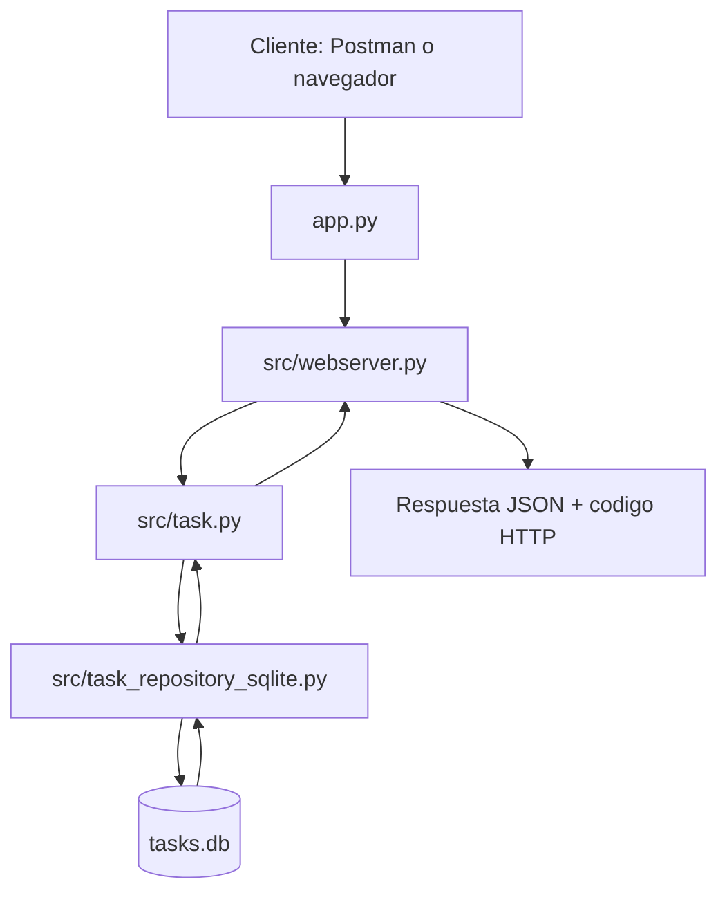

# Guia practica de Flask para este Spike

Documento de apoyo para entender Flask y la arquitectura usada en este repositorio.

## 1. Que es Flask

Flask es un micro-framework de Python para crear aplicaciones web y APIs de forma simple y flexible.

- Micro-framework: trae lo esencial y deja que agregues lo demas cuando lo necesites.
- Ideal para aprender APIs REST porque el flujo es facil de seguir.

## 2. Estructura minima de una app Flask

```python
from flask import Flask

app = Flask(__name__)

@app.route("/")
def home():
    return "Hola Flask"

if __name__ == "__main__":
    app.run(debug=True)
```

Que ocurre en este ejemplo:

- `Flask(__name__)`: crea la aplicacion.
- `@app.route("/")`: conecta la URL `/` con una funcion.
- `home()`: responde a la peticion HTTP.

## 3. Rutas y decoradores (router)

Los decoradores indican que funcion se ejecuta segun la ruta y el metodo HTTP.

```python
@app.get("/tasks")
def listar_tareas():
    ...

@app.post("/tasks")
def crear_tarea():
    ...
```

## 4. Organizacion del codigo (segmentacion)

Cuando el proyecto crece, separar responsabilidades evita archivos gigantes y facilita pruebas.

En este repo:

```text
Flask_Spike/
├── app.py                         # Punto de entrada
├── src/
│   ├── webserver.py               # Endpoints HTTP
│   ├── task.py                    # Logica de negocio
│   └── task_repository_sqlite.py  # Acceso a datos SQLite
└── requirements.txt
```

## 5. requirements.txt

`requirements.txt` lista dependencias del proyecto para instalar el mismo entorno en otra maquina.

Instalacion recomendada:

```bash
python3 -m venv .venv
source .venv/bin/activate
python -m pip install -r requirements.txt
```

## 6. CRUD en Flask

CRUD = Create, Read, Update, Delete.

- `POST /tasks`: crear
- `GET /tasks`: listar
- `GET /tasks/<id>`: leer una tarea
- `PUT /tasks/<id>`: actualizar
- `DELETE /tasks/<id>`: eliminar

Ejemplo base:

```python
@app.post("/tasks")
def crear_tarea():
    ...

@app.get("/tasks")
def listar_tareas():
    ...

@app.put("/tasks/<int:id>")
def actualizar_tarea(id):
    ...

@app.delete("/tasks/<int:id>")
def borrar_tarea(id):
    ...
```

## 7. Utilidades de Flask que mas se usan

### request

Lee datos que envia el cliente.

```python
from flask import request

data = request.get_json()
```

### jsonify

Devuelve respuestas en JSON de forma correcta.

```python
from flask import jsonify

return jsonify({"message": "Tarea creada"}), 201
```

### abort

Corta la ejecucion con un error HTTP cuando algo no cumple validaciones.

```python
from flask import abort

if not tarea:
    abort(404, description="Tarea no encontrada")
```

## 8. SQLite en este proyecto

SQLite guarda los datos en un archivo (`tasks.db`) y es una gran opcion para un spike.

Conexion tipica:

```python
import sqlite3

def get_db_connection():
    conn = sqlite3.connect("tasks.db")
    conn.row_factory = sqlite3.Row
    return conn
```

Uso basico:

```python
con = sqlite3.connect("tasks.db")
cur = con.cursor()
cur.execute("SELECT * FROM tasks")
rows = cur.fetchall()
con.close()
```

## 9. Flujo de una peticion en esta API



Resumen del recorrido:

1. Entra una peticion HTTP.
2. Flask la enruta al controlador.
3. El controlador delega en la capa de negocio.
4. La capa de negocio usa el repositorio para leer/escribir en SQLite.
5. Se devuelve JSON con codigo HTTP adecuado.

## 10. Recomendaciones para seguir

- Validar payloads de entrada (`titulo`, tipos, longitudes).
- Centralizar manejo de errores para respuestas consistentes.
- Agregar tests de endpoints (`GET`, `POST`, `PUT`, `DELETE`).
- Mantener separadas rutas, negocio y acceso a datos.

## 11. Conclusiones

Flask permite construir APIs de forma rapida y clara. En este spike, la separacion por capas (`webserver`, `task`, `repository`) facilita entender el flujo completo desde la peticion hasta la base de datos.
